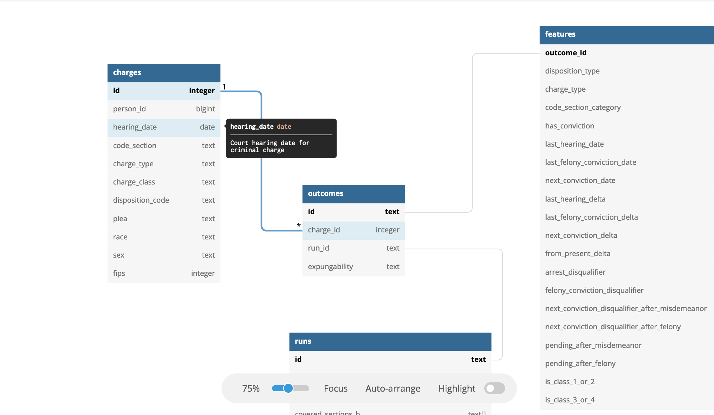

# LAJC Expungement Project

Project to help the Legal Aid and Justice Center with analysis to support efforts to expand criminal record expungement reform in Virginia.

For more details, see the [project page](https://www.codeforcville.org/lajc-expungement) on the Code for Charlottesville website. 

## Getting Started

Currently, data for this project is stored in a PostGreSQL DB only accessible from Code for Charlottesville's JupyterHub deployment, avaliable at [tljh.codeforcville.org](tljh.codeforcville.org). 

If you do not yet have login access for JupyterHub, but you would like to get connected and help out, please reach out via the questions box at the bottom of the above project page. 

For examples of connecting to the database, see [the `/examples` folder](examples). 

- Example of connecting from a Python notebook: [templates/db_example_python.ipynb](templates/db_example_python.ipynb)

## Database Documentation

[Visit the database documentation on dbdocs.io](https://dbdocs.io/isaak-a/expungement) :link:

[1]: https://dbdocs.io/isaak-a/expungement

The above documentation site is generated from [`va_courts.dbml`](va_courts.dbml), a database schema definition file written in DBML (Database Modeling Language). 

**Note**: DBML is a very new open source standard for database documentation backed by Holistics.io, the company behind dbdocs.io, which we are using for the above docs. To learn more, see the [DBML Homepage](https://www.dbml.org/home/). 

## About the Data

Data for this project comes from [VirginiaCourtData.org](https://virginiacourtdata.org/), a website with data pulled from government-published court data. Read more on the [Project Page](https://www.codeforcville.org/lajc-expungement). 
